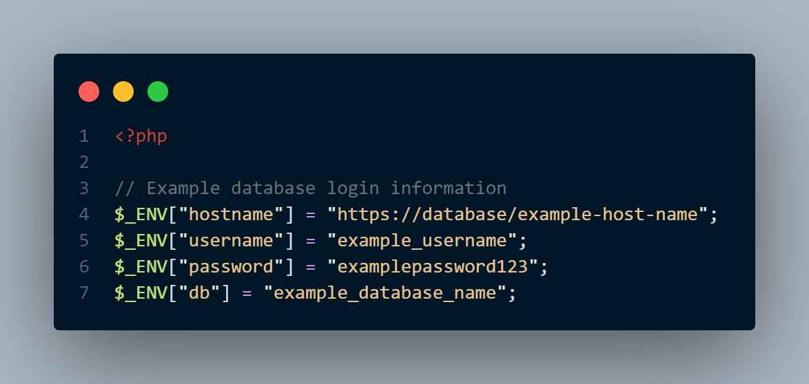

# capstone-website
This is the website for Mizzou IT Senior Capstone - Group 6. We are also working with Allee Autobody LLC a local auto repair shop in Columbia, MO.

## How to Run the Code

### Cloning the repository
To clone the GitHub repository, navigate to the folder of your choosing in your terminal and enter `git clone https://github.com/OwenR21/capstone-website.git`. Then cd into the repository with `cd capstone-website`.

### Our Tech Stack
This website is built and hosted using an AMP (Apache, MySQL, PHP) stack. You can download all of this software for free from the following websites.
- [Apache](https://httpd.apache.org/download.cgi)
- [MariaDB](https://mariadb.org/download/?t=mariadb&p=mariadb&r=11.3.2&os=windows&cpu=x86_64&pkg=msi&mirror=starburst_stlouis)
- [PHP](https://www.php.net/downloads.php)

### Using a .env file
To protect sensitive information we opted to use a `.env` file for our database login information. Make sure to include this `.env` file in the `.gitignore` folder so that it won't be pushed to a repository. PHP does not have an *easy* way to load data from a `.env` file, so here are three solutions we have found:

#### 1. vlucas/phpdotenv
The PHP library vlucas/phpdotenv seems to be the most popular way to load information from a `.env` file into PHP. You can find more about this library on [GitHub](https://github.com/vlucas/phpdotenv). This is commonly added to projects using [Composer](https://getcomposer.org/).

#### 2. Loading information yourself
A second option (which we are currently opting for) is to load the information from the `.env` file yourself in a .php file. In our project this is done in `get_env.php`.

#### 3. Using an env.php file
Lastly, you can hard code in your environment variables in a `dotenv.php` file (See screenshot below). However, most people are more accustomed to using a `.env` file due to experience with the many other languages that use them.

## Information about the Project

### Purpose
This project is for an autobody shop. It will allow customers to see their invoices in pdf form in the browser as well as be able to download the pdf.

### Our System
To do this, pdf invoices will be stored on the QNAP. MariaDB is hosted from the QNAP as well. When the website is logged into by a customer, it will query the database 

### Routing
It's good practice to not allow users to see all of your code. To handle this we are using an index.php file to redirect users to the necessary files.