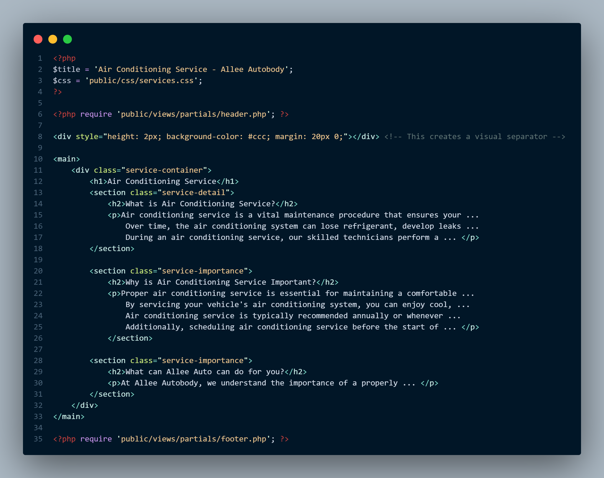

# capstone-website


A website for Mizzou IT Senior Capstone - Group 6. We are also working with Allee Autobody LLC a local auto repair shop in Columbia, MO.

## Table of Contents
- [Getting Started](#getting-started)

## Getting Started
This website is built and hosted using Apache and PHP. You can download all of this software for free from the following websites.
- [Apache](https://httpd.apache.org/download.cgi)
- [PHP](https://www.php.net/downloads.php)

This repository focuses on the website portion through PHP. Below is our project file structure. To ensure the project will work right, you can use the same file structure (making sure to include your own file for `.gitignore`).


### Tools Required
- A text editor or IDE
- A server (can be localhost)

### Cloning the repository
To clone the GitHub repository, navigate to the folder of your choosing in your terminal and enter 

```shell
git clone https://github.com/OwenR21/capstone-website.git
```

Then cd into the repository with

```shell
cd capstone-project
```

## Development

### Purpose
This project is for an autobody shop. It will allow customers to find out more about Allee Autobody LLC, information about their services, and information on how to contact them.

### Routing
It's good practice to not allow users to see all of your code. To handle this we are using an index.php file to redirect users to the necessary files.


### Partials
We made careful use of [partials](https://foilphp.github.io/Foil/docs/TEMPLATES/PARTIALS.html#:~:text=Partials%20are%20template%20files%20that,repeated%20among%20templates%20or%20layouts.) within our code to avoid large amounts of duplication. This makes the code cleaner and easier to read and understand. In our case, this means we can break down a page into smaller chunks that can be reused:



## Running the App
1. Navigate to the `/capstone-project` directory
2. Start your server
3. Navigate to the host in your browser (`localhost:3000`)

## Authors
- **Owen Rosel**
    - [Github](https://github.com/OwenR21)
- **Chris Chandler**
- **James Lyerla**
    - [GitHub](https://github.com/lyerlajd)
- **Adam Allee**
- **Jake Fridley**